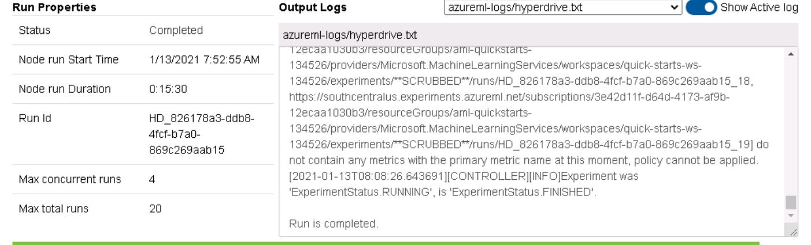
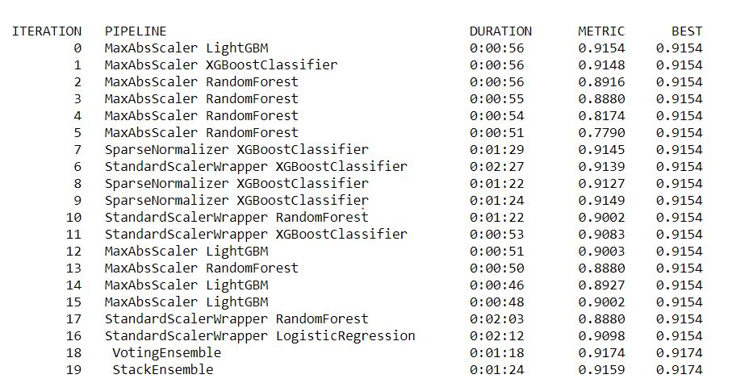
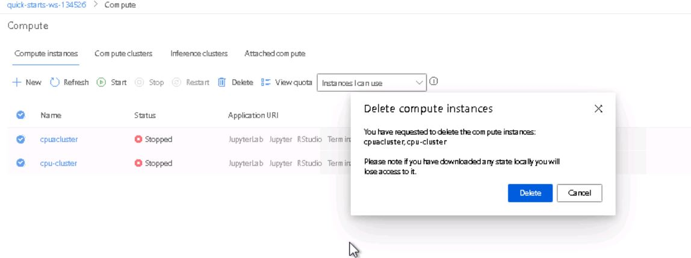

# Optimizing an ML Pipeline in Azure
## (part of Udacity's Machine Learning Engineer with Microsoft Azure NanoDegree)

## Project Overview
This project aims at creating a machine learning model using the HyperDrive for optimizing the pipeline and comparing the results obtained with the model constructed using Azure AutoML.
To build the pipeline we use Python SDK and a Scikit-learn model.

## Project Summary
The best run model is the AutoML model "VotingEnsemble" with an Id: AutoML_10a12021-419a-46bc-9736-103ece2219b6_18 and Accuracy:0.9173899034676254.
It performs better than the logistic regression(Scikit-learn) model using HyperDrive optimized hyperparameters. 
Here we can find that AutoML generates efficient and accurate model.

## Architecture
The project architecture involves the following major steps:
script file : train.py
* Import the dataset from the specified URL.
* Cleaning the Data.
* Splitting the data into train and test datasets with 8:2 ratio of total available data respectively.

jupyter notebook : udacity-project-Copy1.ipynb
* Creating a workspace for the pipeline.
* Using CPU clusters if already existing or create new cluster.
* I used Random sampling method for optimizing the hyperparameters 'C' and 'max_iter' using uniform and randint hyperdrive parameter expressions.
* The early termination policy is BanditPolicy with an evaluation interval of 2 and slack_factor of 10%.
* The hyperdrive is configured using the SKLearn estimator, hyperparameter sampler, and policy.
* Once the run is finished I registered the best model obtained using HyperDrive.
* For AutoML model
  * we obtain a csv webfile dataset.
  * configure by setting the parameters of AutoMLConfig.
  * submit the AutoML run.
  * Obtain the metrics from the model.
* Save the best model.

### About the DataSet
I used the data set containing a Bank's Marketing data that involves a target label of binary classification mentioning whether the customer will do a deposit or not, labelled with the name 'y'. This data set can be found at "https://automlsamplenotebookdata.blob.core.windows.net/automl-sample-notebook-data/bankmarketing_train.csv"

### Algorithm
We used the Logistic regression is a supervised learning classification algorithm that does two class Binary classification to predict the discrete values {'yes' or 'no'} for the column labelled 'y' in the dataset.

### Hyperparameters
The two Hyperparameters used are the 'C' or inverse regularization parameter and 'max_iter' representing the maximum number of iterations that are allowed. To perform this I used RandomParameterSampler that allows to find the better values out of large space randomly with less computation power.

## Parameter sampler
I used the RandomParameterSampler as it can be used for the early termination of the low-performance runs and also to find better metrics that could help to refine the search space. The Random Search for parameters can get good results with less amount of time.
## Policy
An early termination policy can be used to terminate the poorly performing runs. Thus improves the computational efficiency.I used BanditPolicy with an evaluation interval and slack factor.Here the evaluation interval specifies the frequency of applying the policy which is 2.The runs whose best metric is less than
                                      (primary metric of best performing run at given interval/(1+slack factor))     
will be terminated. Here the slack factor taken is '0.1' .
 

## AutoML
The AutoML model 'Voting Ensemble' gave an accuracy of 91.74%. Voting Ensemble is an ensemble model which combines multiple models to improve the final results.As we are performing the classification task this model uses the weighted average of predicted class probabilities to predict the output.
The model is configured with the parameters experiment timeout, compute target, task, primary metric,training data,label column name,iterations, max concurrent iterations, n cross validations. Here the task is classification and the iterations is fixed to 20 which specifies the number of times a model is iterated to find a better accuracy metric .The primary metrics can be accuracy, AUC,.... Cross validation is used as a technique to split original data into the train and test which I speified as 4 folds.
The parameters generated by the model include the learning rate of the model, the loss function of the model, the maximum number of iterations allowed, the number of CPU cores used, random state instance. Through the iterations the LightGBM as a base had a metric of 0.9154 that was outperformed by Voting Ensemble with 0.9174 result.                                                                                                                            

## Comparision
In Hyperdrive I used logistic regression model for the prediction with hyperparameters namely C, max_iter, where as in AutoML multiple models were generated with less human intervention and less time which would otherwise needed more effort for tuning the hyperparameters and training these models.  
For this particular project on classification of customers in Bank Fixed Deposit the AutoMl model is more accurate.
The best model obtained using HyperDrive was found with an Accuracy: 0.9130500758725342 where as the best AutoMl model 'VotingEnsemble' had an Accuracy: 0.9173899034676254. So we conclude that use of AutoML.
Coming to the aspect of execution time I found that the hyperdrive took comparitively less time to generate the model.

## Areas of Improvement
I found that the dataset is imbalanced and further use of data cleaning techniques could help us get better accuracy models.

## Proof of Cleaning clusters

## References
https://docs.microsoft.com/en-us/azure/machine-learning/tutorial-first-experiment-automated-ml
https://docs.microsoft.com/en-us/azure/machine-learning/how-to-configure-auto-train
https://docs.microsoft.com/en-us/azure/machine-learning/how-to-train-scikit-learn
https://azure.microsoft.com/en-in/resources/templates/101-machine-learning-compute-create-amlcompute/
https://github.com/Azure/MachineLearningNotebooks/tree/master/how-to-use-azureml/work-with-data/datasets-tutorial/train-with-datasets
https://github.com/Azure/MachineLearningNotebooks/blob/master/how-to-use-azureml/ml-frameworks/scikit-learn/train-hyperparameter-tune-deploy-with-sklearn/train-hyperparameter-tune-deploy-with-sklearn.ipynb
